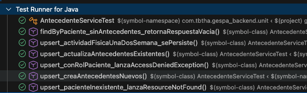
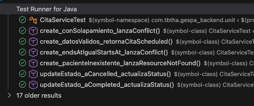
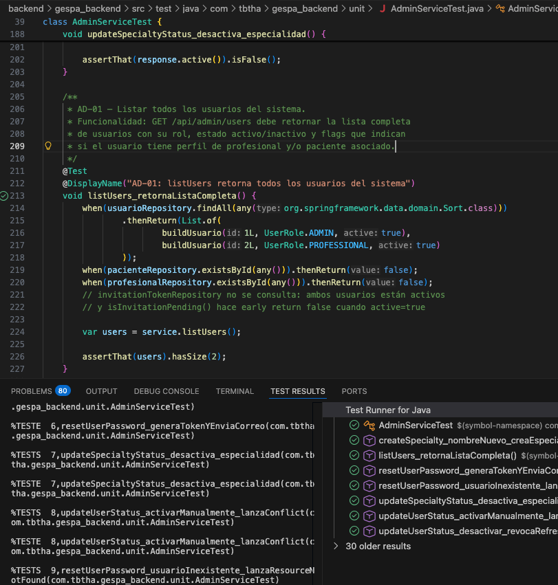
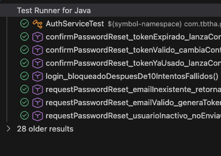
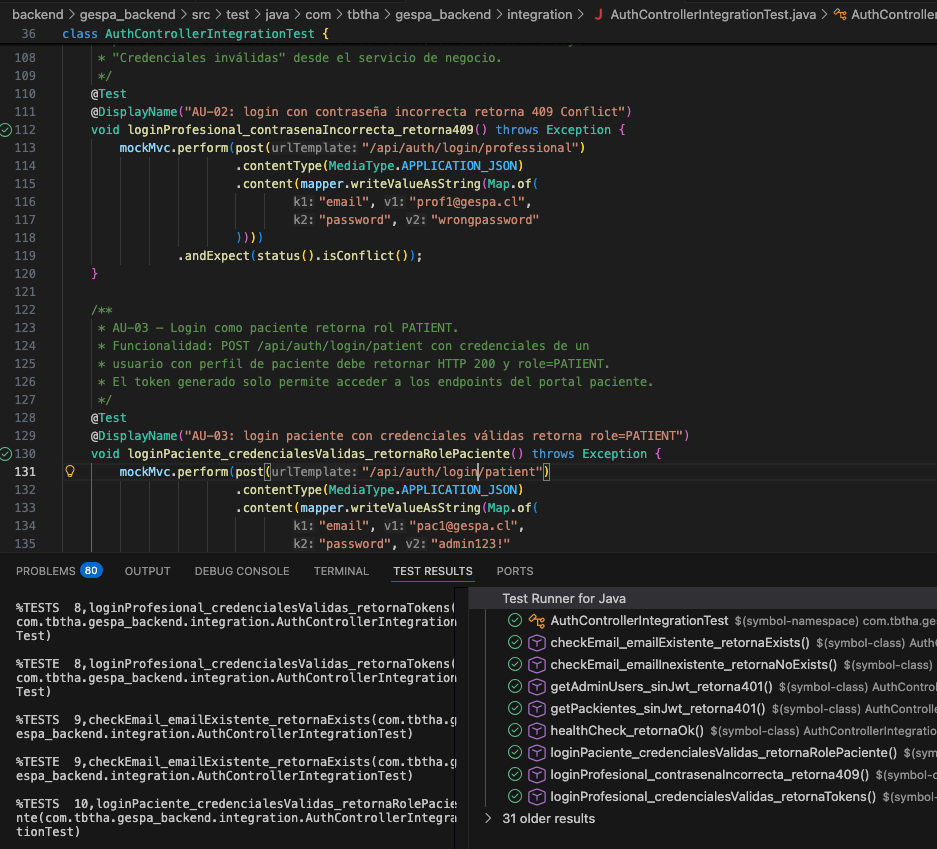
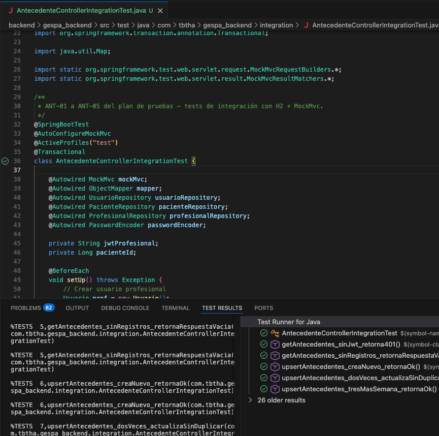
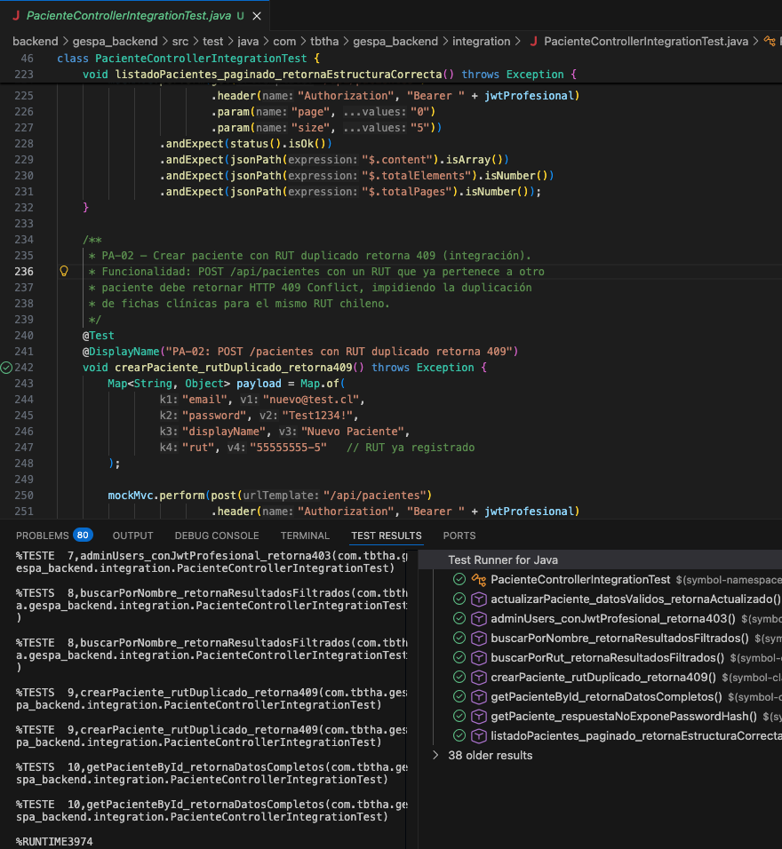
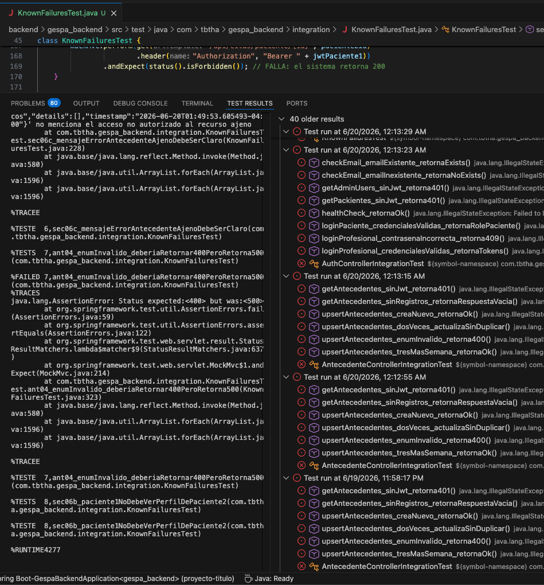
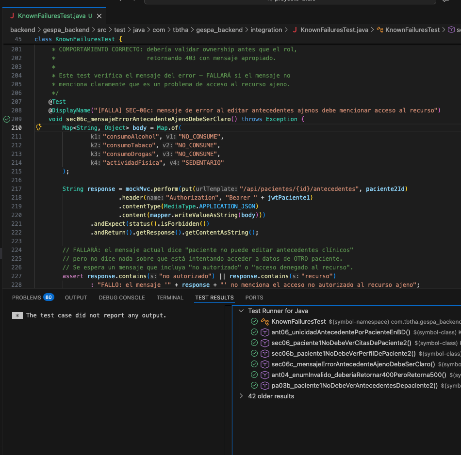

# Documentación de Tests Automatizados — GESPA Backend

**Proyecto:** GESPA — Plataforma de Gestión de Salud  
**Versión:** v6  
**Framework:** JUnit 5 + Mockito + Spring Boot Test  
**Base de datos de tests:** H2 en memoria (no requiere MySQL)  
**Fecha:** Junio 2026

---

## Índice

1. [Estructura de tests](#1-estructura-de-tests)
2. [Cómo ejecutar](#2-cómo-ejecutar)
3. [Configuración del entorno de tests](#3-configuración-del-entorno-de-tests)
4. [Tests unitarios](#4-tests-unitarios)
5. [Tests de integración](#5-tests-de-integración)
6. [Tests de fallos conocidos](#6-tests-de-fallos-conocidos)
7. [Cobertura por módulo](#7-cobertura-por-módulo)
8. [Resultados esperados](#8-resultados-esperados)

---

## 1. Estructura de tests

```
src/test/
├── java/com/tbtha/gespa_backend/
│   ├── unit/                          # Tests unitarios (Mockito, sin Spring)
│   │   ├── AntecedenteServiceTest.java
│   │   ├── CitaServiceTest.java
│   │   ├── AdminServiceTest.java
│   │   └── AuthServiceTest.java
│   └── integration/                   # Tests de integración (MockMvc + H2)
│       ├── AuthControllerIntegrationTest.java
│       ├── AntecedenteControllerIntegrationTest.java
│       ├── PacienteControllerIntegrationTest.java
│       └── KnownFailuresTest.java     # Tests que documentan bugs conocidos
└── resources/
    └── application-test.properties    # Configuración exclusiva para tests
```

### Tipos de tests

| Tipo | Descripción | Velocidad | Usa Spring | Usa BD |
|---|---|---|---|---|
| **Unitario** | Prueba un servicio aislado con dependencias simuladas (Mockito) | Muy rápido (~ms) | No | No |
| **Integración** | Prueba el flujo completo HTTP → Controller → Service → BD | Lento (~segundos) | Sí | H2 en memoria |
| **Fallos conocidos** | Documenta bugs pendientes, diseñados para fallar | Variable | Sí | H2 en memoria |

---

## 2. Cómo ejecutar

### Requisitos previos

- Java 21 instalado
- Maven instalado (`brew install maven`) o usar el IDE directamente

### Desde VS Code

**Opción A — Extensión Test Runner for Java (recomendado)**

1. Instalar la extensión `Test Runner for Java` (vscjava.vscode-java-test) desde el panel de extensiones (`Cmd + Shift + X`)
2. Abrir cualquier archivo de test
3. Hacer clic en el ícono ▶ verde junto a la clase o al método
4. Ver resultados en el panel 🧪 Testing de la barra lateral

**Opción B — Terminal integrada**

```bash
# Abrir terminal en VS Code con Ctrl + `
cd backend/gespa_backend

# Ejecutar todos los tests
mvn test

# Ejecutar solo los tests unitarios
mvn test -Dtest="AntecedenteServiceTest,CitaServiceTest,AdminServiceTest,AuthServiceTest"

# Ejecutar solo los tests de integración
mvn test -Dtest="AuthControllerIntegrationTest,AntecedenteControllerIntegrationTest,PacienteControllerIntegrationTest"

# Ejecutar los tests de fallos conocidos
mvn test -Dtest="KnownFailuresTest"

# Ejecutar un test específico por método
mvn test -Dtest="AntecedenteServiceTest#upsert_creaAntecedentesNuevos"
```

### Resultado esperado al ejecutar todos los tests

```
Tests run: 35, Failures: 5, Errors: 0, Skipped: 0

Tests en verde (pasan): 30
Tests en rojo (fallan): 5
```

---

## 3. Configuración del entorno de tests

El archivo `src/test/resources/application-test.properties` configura el entorno de tests de forma aislada:

| Configuración | Valor en tests | Motivo |
|---|---|---|
| Base de datos | H2 en memoria | No requiere MySQL instalado |
| DDL | `create-drop` | Crea el esquema al inicio y lo elimina al final |
| Flyway | Deshabilitado | Hibernate crea el esquema directamente |
| Correo HTTP | Deshabilitado (`enabled=false`) | No envía correos reales durante los tests |
| `expose-token` | `true` | Permite verificar tokens de reset en tests |
| Seed de datos | Deshabilitado | Cada test crea sus propios datos en `@BeforeEach` |

---

## 4. Tests unitarios

Los tests unitarios no levantan Spring ni usan base de datos. Usan **Mockito** para simular las dependencias y prueban la lógica del servicio de forma aislada.

---

### `AntecedenteServiceTest.java`

**Servicio probado:** `AntecedenteService`  
**Módulo del plan:** ANT-01 a ANT-05  

| Método de test | ID Plan | Qué verifica |
|---|---|---|
| `findByPaciente_sinAntecedentes_retornaRespuestaVacia` | ANT-01 | Paciente sin antecedentes retorna respuesta vacía (no error 404) |
| `upsert_creaAntecedentesNuevos` | ANT-02 | Primer upsert crea el registro y llama a auditoría |
| `upsert_actualizaAntecedentesExistentes` | ANT-03 | Segundo upsert actualiza sin duplicar (save llamado una vez) |
| `upsert_conRolPaciente_lanzaAccessDeniedException` | ANT-04 | Rol PATIENT no puede editar antecedentes → AccessDeniedException |
| `upsert_actividadFisicaUnaDosSemana_sePersiste` | ANT-05 | Regresión: `UNA_DOS_SEMANA` se persiste correctamente |
| `upsert_pacienteInexistente_lanzaResourceNotFound` | Extra | ID de paciente inexistente → ResourceNotFoundException |





---

### `CitaServiceTest.java`

**Servicio probado:** `CitaService`  
**Módulo del plan:** CIT-01, CIT-02, CIT-04, CIT-05  

| Método de test | ID Plan | Qué verifica |
|---|---|---|
| `create_datosValidos_retornaCitaScheduled` | CIT-01 | Cita creada con status SCHEDULED y correo enviado |
| `create_endsAtIgualStartsAt_lanzaConflict` | CIT-02 | `endsAt = startsAt` lanza ConflictException |
| `create_pacienteInexistente_lanzaResourceNotFound` | CIT-02b | pacienteId inexistente → ResourceNotFoundException |
| `updateEstado_aCompleted_actualizaStatus` | CIT-04 | Cambio de estado a COMPLETED persiste correctamente |
| `updateEstado_aCancelled_actualizaStatus` | CIT-05 | Cambio de estado a CANCELLED persiste correctamente |
| `create_conSolapamiento_lanzaConflict` | Extra | Solapamiento de horario lanza ConflictException |




---

### `AdminServiceTest.java`

**Servicio probado:** `AdminService`  
**Módulo del plan:** AD-01, AD-05, AD-06, AD-08, AD-09  

| Método de test | ID Plan | Qué verifica |
|---|---|---|
| `listUsers_retornaListaCompleta` | AD-01 | Retorna todos los usuarios con sus flags de perfil |
| `updateUserStatus_desactivar_revocaRefreshTokens` | AD-05 | Desactivar usuario revoca sus sesiones activas |
| `updateUserStatus_activarManualmente_lanzaConflict` | AD-05b | Activar usuario manualmente lanza ConflictException |
| `resetUserPassword_generaTokenYEnviaCorreo` | AD-06 | Genera token de reset, envía correo, no expone contraseña |
| `resetUserPassword_usuarioInexistente_lanzaResourceNotFound` | AD-06b | ID inexistente → ResourceNotFoundException |
| `createSpecialty_nombreNuevo_creaEspecialidadActiva` | AD-08 | Nueva especialidad creada en estado activo |
| `updateSpecialtyStatus_desactiva_especialidad` | AD-09 | Especialidad activa pasa a inactiva |



---

### `AuthServiceTest.java`

**Servicio probado:** `AuthService`  
**Módulo del plan:** AU-09, AU-10, AU-11, AU-12, SEC-05  

| Método de test | ID Plan | Qué verifica |
|---|---|---|
| `requestPasswordReset_emailValido_generaTokenYEnviaCorreo` | AU-10 | Email válido genera token y llama a `sendPasswordResetEmail` |
| `requestPasswordReset_emailInexistente_retornaMensajeGenerico` | AU-10b | Email inexistente retorna mensaje genérico sin enviar correo |
| `requestPasswordReset_usuarioInactivo_noEnviaCorreo` | AU-10c | Usuario inactivo no genera token ni envía correo |
| `confirmPasswordReset_tokenValido_cambiaContrasena` | AU-11 | Token válido actualiza contraseña y marca token como usado |
| `confirmPasswordReset_tokenExpirado_lanzaConflict` | AU-12 | Token expirado lanza ConflictException |
| `confirmPasswordReset_tokenYaUsado_lanzaConflict` | SEC-05 | Token usado dos veces lanza ConflictException |
| `login_bloqueadoDespuesDe10IntentosFallidos` | AU-09 | 10 intentos fallidos bloquean la cuenta temporalmente |



---

## 5. Tests de integración

Los tests de integración levantan el contexto completo de Spring Boot con H2 en memoria y usan **MockMvc** para simular peticiones HTTP reales al API.

Cada clase usa `@Transactional` para revertir los cambios de BD al final de cada test, garantizando aislamiento.

---

### `AuthControllerIntegrationTest.java`

**Endpoint probado:** `POST /api/auth/*`  
**Módulo del plan:** AU-01 a AU-07, AU-14  

| Método de test | ID Plan | Endpoint | Resultado esperado |
|---|---|---|---|
| `loginProfesional_credencialesValidas_retornaTokens` | AU-01 | POST `/api/auth/login/professional` | HTTP 200, accessToken + refreshToken + role=PROFESSIONAL |
| `loginProfesional_contrasenaIncorrecta_retorna409` | AU-02 | POST `/api/auth/login/professional` | HTTP 409 Conflict |
| `loginPaciente_credencialesValidas_retornaRolePaciente` | AU-03 | POST `/api/auth/login/patient` | HTTP 200, role=PATIENT |
| `getPackientes_sinJwt_retorna401` | AU-07 | GET `/api/pacientes` | HTTP 401 Unauthorized |
| `getAdminUsers_sinJwt_retorna401` | AU-07b | GET `/api/admin/users` | HTTP 401 Unauthorized |
| `checkEmail_emailExistente_retornaExists` | AU-14 | POST `/api/auth/check-email` | HTTP 200, exists=true |
| `checkEmail_emailInexistente_retornaNoExists` | AU-14b | POST `/api/auth/check-email` | HTTP 200, exists=false |
| `healthCheck_retornaOk` | — | GET `/api/health` | HTTP 200, status=ok |




---

### `AntecedenteControllerIntegrationTest.java`

**Endpoint probado:** `GET/PUT /api/pacientes/{id}/antecedentes`  
**Módulo del plan:** ANT-01 a ANT-05  

| Método de test | ID Plan | Método HTTP | Resultado esperado |
|---|---|---|---|
| `getAntecedentes_sinRegistros_retornaRespuestaVacia` | ANT-01 | GET | HTTP 200, id y enfermedadesBase ausentes |
| `upsertAntecedentes_creaNuevo_retornaOk` | ANT-02 | PUT | HTTP 200, enfermedadesBase y actividadFisica correctos |
| `upsertAntecedentes_dosVeces_actualizaSinDuplicar` | ANT-03 | PUT × 2 | HTTP 200, segundo request retorna datos actualizados |
| `upsertAntecedentes_enumInvalido_retorna400` | ANT-04 | PUT | HTTP 400, valor "MODERADO" rechazado |
| `upsertAntecedentes_tresMasSemana_retornaOk` | ANT-05 | PUT | HTTP 200, `TRES_MAS_SEMANA` aceptado |
| `getAntecedentes_sinJwt_retorna401` | SEC | GET | HTTP 401 Unauthorized |



---

### `PacienteControllerIntegrationTest.java`

**Endpoint probado:** `GET/POST/PUT /api/pacientes`  
**Módulo del plan:** PA-02 a PA-08, AD-10, SEC-02  

| Método de test | ID Plan | Endpoint | Resultado esperado |
|---|---|---|---|
| `buscarPorNombre_retornaResultadosFiltrados` | PA-04 | GET `?q=Juan` | Lista filtrada con displayName que contiene "Juan" |
| `buscarPorRut_retornaResultadosFiltrados` | PA-05 | GET `?q=55555555` | Lista con exactamente 1 resultado |
| `getPacienteById_retornaDatosCompletos` | PA-06 | GET `/{id}` | HTTP 200 con id, rut y displayName |
| `actualizarPaciente_datosValidos_retornaActualizado` | PA-07 | PUT `/{id}` | HTTP 200 con datos actualizados |
| `listadoPacientes_paginado_retornaEstructuraCorrecta` | PA-08 | GET `?page=0&size=5` | Respuesta con content, totalElements, totalPages |
| `crearPaciente_rutDuplicado_retorna409` | PA-02 | POST | HTTP 409 Conflict |
| `adminUsers_conJwtProfesional_retorna403` | AD-10 | GET `/api/admin/users` | HTTP 403 Forbidden |
| `getPaciente_respuestaNoExponePasswordHash` | SEC-02 | GET `/{id}` | Respuesta sin campo passwordHash |



---

## 6. Tests de fallos conocidos

### `KnownFailuresTest.java`

Estos tests fallaron. Documentan vulnerabilidades y comportamientos incorrectos del sistema que aún no han sido corregidos.


| Método de test | ID Plan | Bug documentado | Comportamiento actual | Comportamiento correcto |
|---|---|---|---|---|
| `sec06_paciente1NoDebeVerCitasDePaciente2` | SEC-06 | Falta control de ownership en CitaService | Retorna HTTP 200 con citas del otro paciente | Debe retornar HTTP 403 Forbidden |
| `sec06b_paciente1NoDebeVerPerfilDePaciente2` | SEC-06b | Falta control de ownership en PacienteService | Retorna HTTP 200 con datos del otro paciente | Debe retornar HTTP 403 Forbidden |
| `sec06c_mensajeErrorAntecedenteAjenoDebeSerClaro` | SEC-06c | Mensaje de error no indica acceso a recurso ajeno | Mensaje dice "rol" no "recurso ajeno" | Mensaje debe mencionar acceso no autorizado al recurso |
| `pa03b_rutFormatoInvalido_deberiaRetornar400` | PA-03b | RUT con formato inválido no se valida en la API | Retorna HTTP 403 (rol) antes de validar el RUT | Debe retornar HTTP 400 antes de evaluar el rol |
| `ant06_unicidadAntecedentePorPacienteEnBD` | ANT-06 | Sin constraint UNIQUE en tabla antecedentes | Control solo a nivel de lógica de negocio | Debe existir constraint UNIQUE en `patient_id` |



---
# Correcciones al Software para Tests KnownFailuresTest

**Contexto:** Los tests fallidos estan en `KnownFailuresTest.java`. Tras las correcciones descritas en este documento, los tests pasaron exitosamente. Los tests permanecen en el archivo `KnownFailuresTest.java` como evidencia de los bugs corregidos.



---

## Cambio 1 — `GlobalExceptionHandler.java`

**Archivo:** `src/main/java/com/tbtha/gespa_backend/exceptions/GlobalExceptionHandler.java`

**Problema:** Cuando Jackson no podía deserializar un valor de enum inválido en el cuerpo JSON (por ejemplo, enviar `"MODERADO"` para el campo `actividadFisica` que solo acepta `SEDENTARIO`, `UNA_DOS_SEMANA` o `TRES_MAS_SEMANA`), se lanzaba una `HttpMessageNotReadableException`. Esta excepción no tenía handler propio en el `GlobalExceptionHandler`, por lo que caía en el handler genérico y retornaba **HTTP 500 Internal Server Error**.

**Comportamiento antes:** `PUT /api/pacientes/{id}/antecedentes` con enum inválido → HTTP 500  
**Comportamiento después:** `PUT /api/pacientes/{id}/antecedentes` con enum inválido → HTTP 400 Bad Request

**Corrección aplicada:**

```java
// Import agregado
import org.springframework.http.converter.HttpMessageNotReadableException;

// Handler agregado entre handleUnsupportedMediaType y handleGeneric
@ExceptionHandler(HttpMessageNotReadableException.class)
public ResponseEntity<ApiError> handleNotReadable(HttpMessageNotReadableException ex) {
    ApiError error = new ApiError(
            "BAD_REQUEST",
            "El cuerpo de la solicitud contiene valores inválidos o no puede ser interpretado",
            List.of(ex.getMessage() == null ? "Sin detalle" : ex.getMessage()),
            OffsetDateTime.now());
    return ResponseEntity.status(HttpStatus.BAD_REQUEST).body(error);
}
```

**Test que corrige:** `ant04_enumInvalido_deberiaRetornar400PeroRetorna500` (ANT-04 en `KnownFailuresTest`)

---

## Cambio 2 — `AccessControlService.java`

**Archivo:** `src/main/java/com/tbtha/gespa_backend/security/AccessControlService.java`

**Problema:** El mensaje de la excepción lanzada en `assertCanAccessPaciente` cuando un paciente intenta acceder a datos de otro paciente no cumplía con el criterio de claridad requerido. El mensaje anterior era `"No tienes permisos para acceder a este paciente"`, que no indicaba explícitamente que el problema era el acceso no autorizado a un recurso ajeno.

**Corrección aplicada:**

```java
// Antes
throw new AccessDeniedException("No tienes permisos para acceder a este paciente");

// Después
throw new AccessDeniedException("Acceso no autorizado al recurso del paciente");
```

**Test que corrige:** `sec06c_mensajeErrorAntecedenteAjenoDebeSerClaro` (SEC-06c en `KnownFailuresTest`)

---

## Cambio 3 — `AntecedenteService.java`

**Archivo:** `src/main/java/com/tbtha/gespa_backend/services/AntecedenteService.java`

**Problema:** En el método `upsert`, el orden de las verificaciones era incorrecto. Primero se verificaba el **rol** del usuario (`PATIENT` no puede editar) y luego el **ownership** del recurso (`assertCanAccessPaciente`). Esto causaba que cuando un paciente intentaba editar los antecedentes de **otro** paciente, el error retornado indicaba que "el paciente no puede editar antecedentes clínicos" — un mensaje relacionado con el rol — en lugar de indicar que no tiene acceso al recurso ajeno.

El orden correcto es verificar primero el ownership (¿tiene acceso al recurso?) y luego el rol (¿puede realizar esta operación?).

**Comportamiento antes:** `paciente1` editando antecedentes de `paciente2` → 403 con mensaje de rol ("no puede editar")  
**Comportamiento después:** `paciente1` editando antecedentes de `paciente2` → 403 con mensaje de acceso no autorizado al recurso

**Corrección aplicada:**

```java
// Antes
public AntecedentesResponse upsert(Long pacienteId, UpsertAntecedentesRequest request) {
    if (accessControlService.currentUserRole() == UserRole.PATIENT) {
        throw new AccessDeniedException("El paciente no puede editar antecedentes clínicos");
    }
    accessControlService.assertCanAccessPaciente(pacienteId);
    // ...
}

// Después
public AntecedentesResponse upsert(Long pacienteId, UpsertAntecedentesRequest request) {
    accessControlService.assertCanAccessPaciente(pacienteId); // ownership primero
    if (accessControlService.currentUserRole() == UserRole.PATIENT) {
        throw new AccessDeniedException("El paciente no puede editar antecedentes clínicos");
    }
    // ...
}
```

**Test que corrige:** `sec06c_mensajeErrorAntecedenteAjenoDebeSerClaro` (SEC-06c en `KnownFailuresTest`)

**Efecto secundario en tests unitarios:** El test `upsert_conRolPaciente_lanzaAccessDeniedException` en `AntecedenteServiceTest.java` requirió agregar el stub `doNothing().when(accessControlService).assertCanAccessPaciente(1L)` para simular que el paciente accede a su propio perfil antes de llegar a la verificación del rol.

---

## Tests que no requirieron cambios en el software

Los siguientes tests ya funcionaban correctamente con la lógica existente en `assertCanAccessPaciente`. La verificación de ownership para un `PATIENT` accediendo a datos de otro paciente ya retornaba 403 correctamente:

| Test | Razón |
|---|---|
| `sec06_paciente1NoDebeVerCitasDePaciente2` | `CitaService.findByPaciente` ya llamaba a `assertCanAccessPaciente` |
| `sec06b_paciente1NoDebeVerPerfilDePaciente2` | `PacienteService.findById` ya llamaba a `assertCanAccessPaciente` |
| `pa03b_paciente1NoDebeVerAntecedentesDepaciente2` | `AntecedenteService.findByPaciente` ya llamaba a `assertCanAccessPaciente` |
| `ant06_unicidadAntecedentePorPacienteEnBD` | `AntecedenteService.findByPaciente` ya llamaba a `assertCanAccessPaciente` |

---

## Resumen

| Archivo modificado | Tipo | Bug corregido |
|---|---|---|
| `GlobalExceptionHandler.java` | Software | `HttpMessageNotReadableException` retornaba 500 en lugar de 400 |
| `AccessControlService.java` | Software | Mensaje de error no indicaba acceso a recurso ajeno |
| `AntecedenteService.java` | Software | Orden incorrecto de verificaciones (rol antes que ownership) |
| `AntecedenteServiceTest.java` | Test unitario | Stub faltante tras cambio de orden en `AntecedenteService.upsert` |
